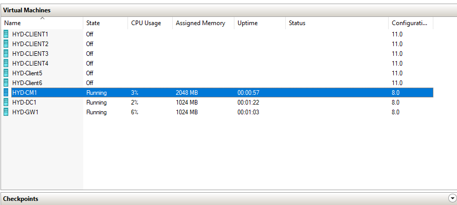
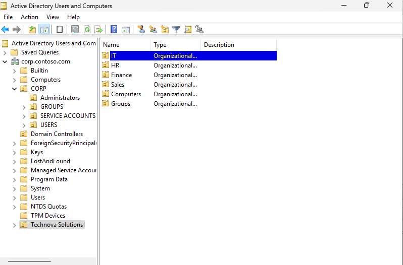
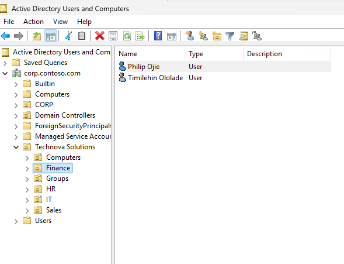
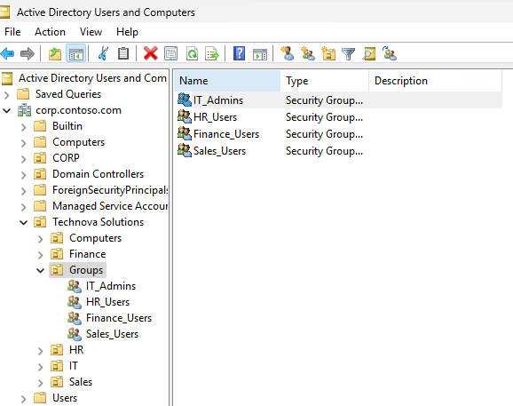
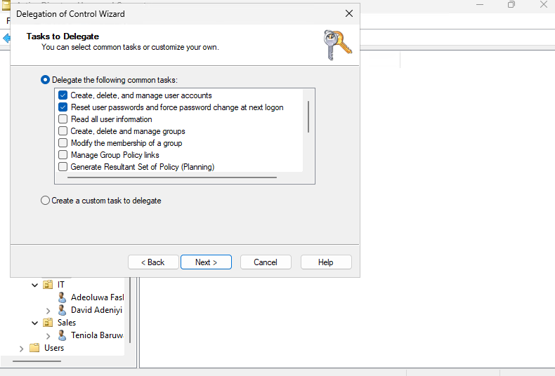
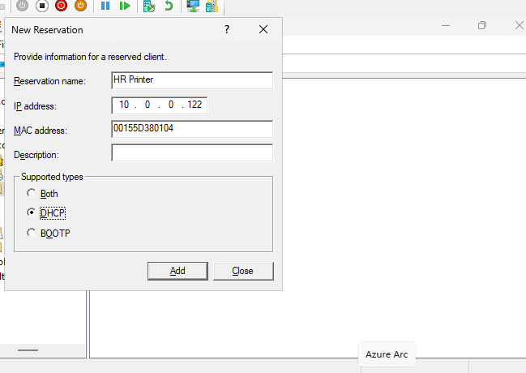
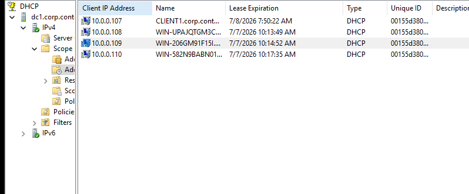
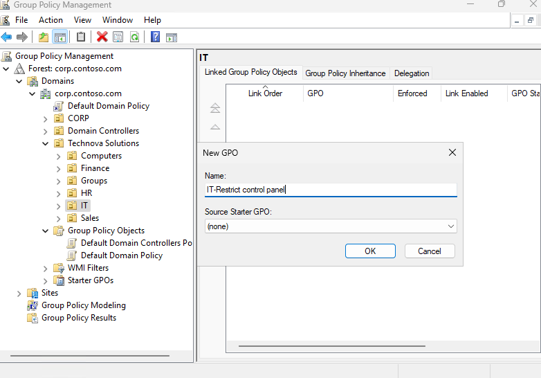
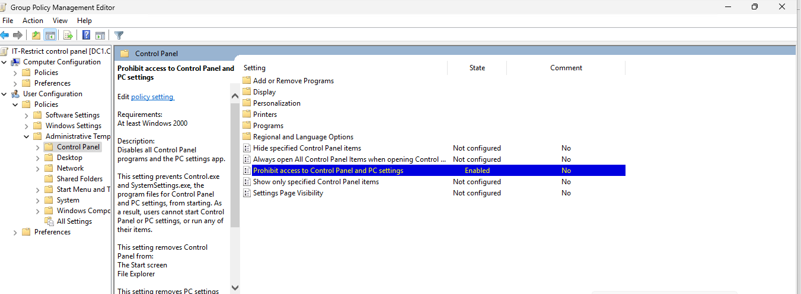
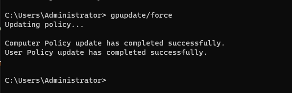

# Windows 11 & Microsoft 365 Enterprise Lab

## Overview

This project documents the deployment and administration of a Windows
enterprise lab environment using Hyper-V. The lab simulates a corporate
Windows infrastructure and demonstrates practical IT support and system
administration tasks, including Active Directory administration, DNS,
DHCP, Group Policy management, Microsoft Configuration Manager (SCCM),
and Windows client administration.

Throughout the project, I configured core Windows Server services,
managed users and computers, implemented security policies, verified
network services, and practiced enterprise troubleshooting using a
multi-machine virtual environment.

------------------------------------------------------------------------

## Technologies Used

-   Hyper-V
-   Windows Server 2022
-   Windows 11 Enterprise
-   Active Directory Domain Services (AD DS)
-   DNS
-   DHCP
-   Group Policy Management (GPMC)
-   Microsoft Configuration Manager (SCCM)
-   Windows Deployment Services (WDS)
-   Windows Assessment and Deployment Kit (ADK)
-   Windows Server Update Services (WSUS)

------------------------------------------------------------------------

## Skills Demonstrated

-   Active Directory Administration
-   Organizational Unit (OU) Management
-   User & Group Management
-   Security Group Administration
-   DNS Administration
-   DHCP Administration
-   Group Policy Management
-   Windows Server Administration
-   Windows Client Administration
-   Enterprise Troubleshooting
-   Hyper-V Virtualization
-   Technical Documentation

------------------------------------------------------------------------

## Project Walkthrough

### Phase 1 -- Lab Deployment

-   Reviewed the Windows 11 and Microsoft 365 Lab Deployment Guide.
-   Verified hardware virtualization support and enabled Hyper-V.
-   Deployed the Windows 11 and Microsoft 365 lab environment.
-   Imported and configured the required virtual machines.
-   Verified communication between the Domain Controller, Configuration
    Manager server, Gateway server, and Windows client machines.
-   Confirmed Active Directory, DNS and DHCP services were operational
    before proceeding with administration tasks.
    
**Fig 1**: Hyper-v running
> 

------------------------------------------------------------------------

### Phase 2 -- Active Directory Administration

-   Designed an Active Directory structure for a fictional company,
    **Technova Solutions**.
-   Created Organizational Units (OUs) for IT, HR, Finance, Sales,
    Computers and Groups.
-   Created departmental user accounts and configured first-time
    password changes.
-   Created and managed security groups to simplify permission
    management.
-   Added users to the appropriate security groups.
-   Reset passwords and managed user accounts.
-   Disabled and re-enabled user accounts.
-   Moved users between departments and updated group memberships.
-   Created computer accounts within the Computers OU.
-   Delegated administrative permissions to the **IT_Admins** security
    group.
-   Explored the Active Directory Administrative Center.

**Fig 2**: Organizational units
> 

**Fig 3**: Finance OU Users
> 

**Fig 4**:Security Groups
> 

**Fig 5**:Control delegation
> 

------------------------------------------------------------------------

### Phase 3 -- DHCP & DNS

#### DHCP

-   Created a DHCP reservation for the HR network printer using its MAC
    address.
-   Configured an exclusion range.
-   Renewed client IP addresses using `ipconfig /release` and
    `ipconfig /renew`.

#### DNS

-   Created a Host (A) record for **FileServer**.
-   Created a CNAME record (**SharedFiles**) pointing to FileServer.
-   Verified name resolution using `ping` and `nslookup`.
-   Confirmed successful DNS resolution.

**Fig 6**:DHCP Reservation
> 

**Fig 7**:DNS
> 
------------------------------------------------------------------------

### Phase 4 -- Group Policy Management

-   Created and linked a Group Policy Object (GPO).
-   Restricted Control Panel access for IT users.
-   Configured password and account lockout policies.
-   Applied policies using `gpupdate /force`.
-   Verified policy application using `gpresult`.
-   Troubleshot Group Policy application by correcting Organizational
    Unit placement.

**Fig 8**:Group Policy Object
> 

**Fig 9**Using GPO to restrict control panel access for a particular OU
> 
> 

------------------------------------------------------------------------

### Phase 5 -- Enterprise Deployment Technologies

-   Explored Microsoft Configuration Manager (SCCM) including Device
    Collections, User Collections, Software Library, Monitoring and
    Administration.
-   Explored Windows Deployment Services (WDS) and the concepts of PXE
    boot, Boot Images and Install Images.
-   Explored the Windows Assessment and Deployment Kit (ADK), including
    Windows SIM and USMT.
-   Reviewed Windows Server Update Services (WSUS) and centralized
    Windows update management.

------------------------------------------------------------------------

### Phase 6 -- Windows 11 Administration

-   Explored Windows administrative tools including Computer Management,
    Device Manager, Event Viewer, Services and Disk Management.
-   Practiced common administrative and diagnostic commands.
-   Reviewed common Windows client administration tasks.

------------------------------------------------------------------------

## Troubleshooting Highlights

During this project I diagnosed and resolved several common enterprise
administration issues, including:

-   Group Policy not applying due to incorrect OU placement.
-   DNS verification and name resolution.
-   DHCP lease renewal and reservation configuration.
-   Password reset and account lockout scenarios.
-   Client connectivity verification.
-   Virtual machine deployment and startup issues.

------------------------------------------------------------------------

## Key Learning Outcomes

Through this project I gained practical experience administering a
Windows enterprise environment, managing Active Directory objects,
configuring DNS, DHCP and Group Policy, understanding Microsoft
deployment technologies, and documenting technical work in a
professional, portfolio-ready format.
